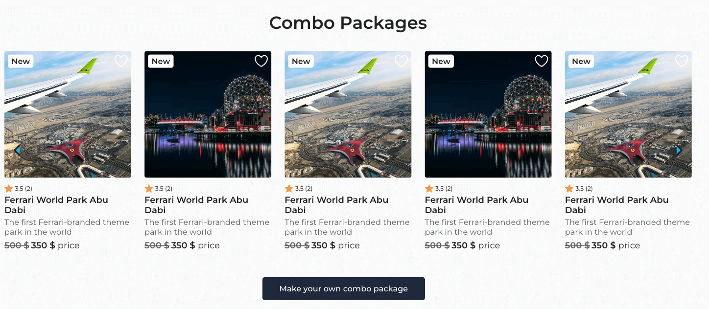

# Веб-приложение для бронирования туров в ОАЭ и Дубай

## Запуск приложения

Команды для запуска сервера для разработки:

1. Установка зависимостей:

`npm run i`

2. Запуск сервера:
```bash

npm run dev

# or

yarn dev

# or

pnpm dev

```
3. Запуск приложения в браузере:

Запустите [http://localhost:3000](http://localhost:3000), чтобы отобразить результат запуска.

## Превью страниц

В превью представлены некоторые страницы с функционалом, которые были разработаны мною в рамках проекта по бронированию туров:

1. Основная страница: http://localhost:3000


2. Страница с турами: http://localhost:3000/catalogue


3. Детальная страница тура: http://localhost:3000/catalogue/tour-details


## UI-компоненты

1. Выпадающее меню:


2. Разнообразные слайдеры:

- C кнопками: 


- C изображениями:




3. Аккордеон 
![[./src/images/imagesForReadMe/ui-components/faq.png|700]]
![[./src/images/imagesForReadMe/ui-components/faq2.png|700]]

4. Отзывы:


5. Карта с чекпоинтами:
![./src/images/imagesForReadMe/ui-components/map.png]

6. Тянущийся роут:


## Формы

1. Форма бронирования:


2. Отзывы:
![[./src/images/imagesForReadMe/ui-components/feedback-form.png|500]]

## Меню-бургер

 