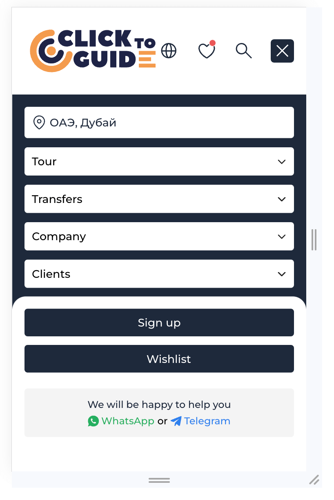

# Веб-приложение для бронирования туров в ОАЭ и Дубай

## Tech Stack


## Запуск приложения

## Клонирование репозитория 

```bash
$ git clone git@github.com:theverybusybee/dubaiTours.git
```

#### install dependencies
```bash
$ npm install
```

#### build project
```bash
$ npm run build
```

#### run prod mode
```bash
$ npm run dev
```

## Запуск приложения

Запустите [http://localhost:3000](http://localhost:3000), чтобы отобразить результат запуска.

## Demo

В превью представлены некоторые страницы с функционалом, которые были разработаны мною в рамках проекта по бронированию туров:

1. Основная страница: http://localhost:3000


2. Страница с турами: http://localhost:3000/catalogue


3. Детальная страница тура: http://localhost:3000/catalogue/tour-details


## UI-компоненты

1. Выпадающее меню:

<p align="center">
  
    &nbsp; &nbsp; &nbsp; &nbsp;
  
</p>

2. Разнообразные слайдеры:

- C кнопками: 

<p align="center">
  
</p>

- C изображениями:

<p align="center">
  
</p>

<hr />

<p align="center">
  
</p>

<hr />

<p align="center">
  
</p>

<hr />

<p align="center">
  
</p>

<p align="center">
  
    &nbsp; &nbsp;
  
</p>

3. Аккордеон 

<p align="center">
  
</p>

<hr />

<p align="center">
  
</p>


4. Отзывы:

<p align="center">
  
</p>

<hr />

<p align="center">
  
</p>

<hr />

<p align="center">
  
</p>

5. Карта с чекпоинтами:

<p align="center">
  
</p>

6. Тянущийся роут:

<p align="center">
  
  &nbsp; &nbsp;
  
</p>

## Формы

1. Форма бронирования:

<p align="center">
  
  &nbsp; &nbsp;
  
</p>

<p align="center">
  
    &nbsp; &nbsp;
  
</p>

2. Отзывы:

<p align="center">
  
</p>

## Меню-бургер

<p align="center">
  
  &nbsp; &nbsp;
  
</p>